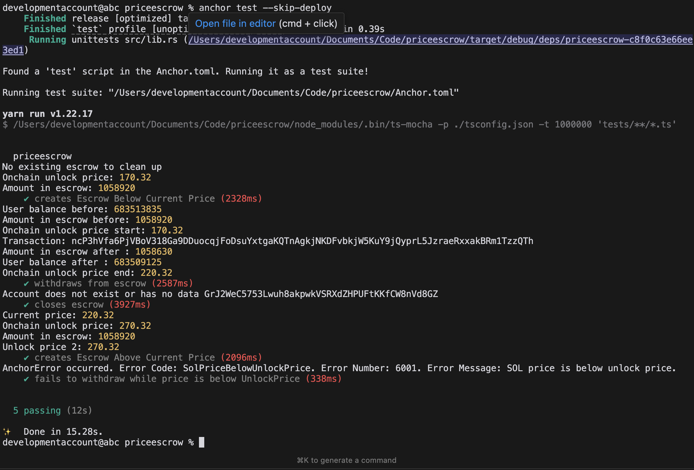

# Lazy Long:  Profit-Taking from SOL Holdings (MVP)

The Lazy Long project is a proof of concept for smart contract profit management. It enables users to deposit SOL into a program that automatically manages their holdings and takes  profits when the value of SOL increases by a certain percentage. This allows users to benefit from price gains without the need to manually track or manage their assets.

## Overview

This program enables conditional SOL transfers based on SOL/USD price thresholds. Users can lock SOL in an escrow account that only becomes withdrawable when SOL reaches a specified price point, creating opportunities for  price-based trading strategies.

## Features

- Deposit SOL directly into the program, securely held in a Program Derived Address (PDA).
- Record the initial price of SOL using a reliable price oracle.
- An off-chain service monitors the price of SOL and triggers the smart contract when the price increases by 10%.
- User can withdraw 10% of SOL value as profit when the price condition is met.
- Update the reference price after every successful profit-taking event to ensure future gains are tracked appropriately.
- Create price-locked escrow accounts.
- Close escrow accounts and recover rent.
- Real-time price feeds from Switchboard oracles.
- Devnet support.

## Live Deployment

- Devnet Program ID: `3xdEMhH9Dm8WZR2uWwnZwazc9dtYwRubDerEptEEMpcd`
- [Devnet Program Explorer](https://solscan.io/account/3xdEMhH9Dm8WZR2uWwnZwazc9dtYwRubDerEptEEMpcd?cluster=devnet)
- [Devnet Example Withdrawal Transaction](https://solscan.io/tx/ncP3hVfa6PjVBoV318Ga9DDuocqjFoDsuYxtgaKQTnAgkjNKDFvbkjW5KuY9jQyprL5JzraeRxxakBRm1TzzQTh?cluster=devnet)


## Prerequisites

- [Solana Tool Suite](https://docs.solana.com/cli/install-solana-cli-tools) v1.17 or later
- [Anchor](https://www.anchor-lang.com/docs/installation) v0.28.0 or later
- [Node.js](https://nodejs.org/) v16 or later
- [Yarn](https://yarnpkg.com/)

## Installation

```bash
git clone <repository-url>
cd priceescrow
yarn install
```

## Build

```bash
anchor build
```

## Test

```bash
anchor test --skip-deploy
```

tests screenshot:



## Program Architecture

The program consists of three main instructions:

1. **Deposit**: Creates an escrow account and deposits SOL with a specified unlock price.
2. **Withdraw**: Withdraws SOL from the escrow when price conditions are met.
3. **Close**: Closes the escrow account and returns rent.

## Example Usage

```typescript
// Create an escrow that unlocks when SOL price reaches $25
await program.methods
  .deposit(new BN(25_000_000)) // $25.00 in 6 decimals
  .accounts({
    user: wallet.publicKey,
    escrowAccount: escrow,
    systemProgram: SystemProgram.programId,
  })
  .signers([wallet])
  .rpc();

// Withdraw when conditions are met
await program.methods
  .withdraw()
  .accounts({
    user: wallet.publicKey,
    escrowAccount: escrow,
    switchboardFeed: SOL_USD_SWITCHBOARD_FEED,
  })
  .signers([wallet])
  .rpc();
```

## Error Handling

The program includes custom error types:

- `SolPriceBelowUnlockPrice`: Attempted withdrawal when SOL price is below unlock price.
- `InvalidSwitchboardFeed`: Invalid or stale price feed data.

## Security Considerations

- Price feeds are verified for staleness.
- Program uses PDAs to prevent account spoofing.
- Escrow accounts are owned by the program.

